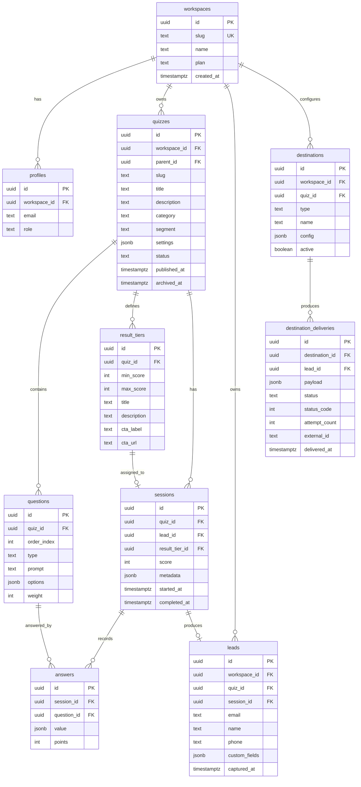

# score-engine — Architecture

> Living document. Last updated: 2026-05-14.
> Owner: Indy
> Status: Pre-build (architecture review)

---

## 1. Purpose & Scope

**score-engine** is a lead-generation quiz platform — a self-hosted alternative to ScoreApp, Outgrow, Interact, and Pointerpro. The product lets a business author scored assessments, publish them at branded URLs, capture leads at the result gate, and (in v2) deliver AI-personalized result narratives.

### In scope (v1)
- Authoring scored multi-step quizzes
- Public quiz pages on a custom subdomain
- Email-gated results delivery
- Lead capture into a queryable database
- CSV export and webhook delivery of leads
- Basic funnel analytics (views, completions, conversion)

### In scope (v2)
- AI-personalized result narratives via Claude API
- Branching/conditional logic between questions
- Transactional email of results to the lead's inbox

### In scope (v3, conditional on demand)
- Multi-tenancy with per-workspace branding
- Workspace signup, billing, plan limits
- Wildcard subdomain routing

### Out of scope (indefinitely)
- A/B testing engine
- Marketing automation (sequences, drip campaigns)
- Built-in CRM (we integrate, we don't replace)
- Translation/i18n (English-only v1–v2)

---

## 2. Stack

| Layer | Choice | Rationale |
|---|---|---|
| Frontend framework | Next.js 14+ (App Router) + TypeScript | SSR/ISR for SEO on public quiz pages; Server Actions clean form handling; first-class Netlify support |
| Styling | Tailwind CSS + shadcn/ui | Fast composition; theme-able for future white-label needs |
| Backend | Supabase (Postgres, Auth, RLS, Storage, Edge Functions) | Single platform for DB + auth + serverless; RLS makes multi-tenant straightforward |
| Auth helpers | `@supabase/ssr` | Modern replacement for the deprecated `auth-helpers-nextjs`; works correctly with App Router |
| Hosting | Netlify (via `@netlify/plugin-nextjs`) | User preference; mature support for App Router, Server Actions, ISR |
| DNS | Cloudflare (existing) | `assess.cyrvana.com` CNAME → Netlify, **set to "DNS only" (gray cloud), not Proxied** — Cloudflare's proxy in front of Netlify causes SSL handshake issues unless configured carefully, and Netlify already CDN-fronts the site |
| AI (v2) | Anthropic Claude API (Sonnet) | Familiar from VORTEX; quality fits narrative generation |
| Transactional email (v2) | **ZeptoMail** (Zoho's transactional service) | Same Zoho account as the Cyrvana mailbox; REST API + SMTP; free tier ~10K/mo for first six months then ~$2.50 per 10K; DKIM/SPF/DMARC on `assess.cyrvana.com` |
| Consent / cookie banner | Termly (existing on cyrvana.com) | Configure Termly to cover the `assess.cyrvana.com` subdomain; embed script in the Next.js `<head>` |
| Observability | Sentry (errors) + Supabase logs (DB) | Lightweight start; PostHog/Plausible later if needed |

### What we explicitly did **not** choose
- **Vercel** — Netlify works equivalently for our needs and matches user preference.
- **Firebase** — weaker SQL story, harder to express scoring logic and analytics.
- **PlanetScale + separate auth** — more moving parts than Supabase.
- **No-code (Tally, Formbricks)** — capped ceiling on UX customization and AI personalization.
- **Vite + React SPA** — earlier candidate; lost to Next.js once SEO on public funnels was prioritized.

---

## 3. URL & Routing Plan

```
assess.cyrvana.com/
├── /                              → marketing landing (optional, v1+)
├── /q/[quiz-slug]                 → public quiz taker (SSG + ISR)
├── /q/[quiz-slug]/results         → results page (dynamic, per-session)
├── /admin                         → admin dashboard (auth-gated)
│   ├── /admin/quizzes             → list + create
│   ├── /admin/quizzes/[id]/edit   → quiz builder
│   ├── /admin/quizzes/[id]/leads  → lead viewer
│   ├── /admin/quizzes/[id]/webhooks → webhook config
│   └── /admin/settings            → workspace settings
└── /api/
    ├── /api/sessions              → POST: start session
    ├── /api/answers               → POST: submit answer batch
    ├── /api/leads                 → POST: capture lead at gate
    ├── /api/webhooks/deliver      → internal cron: webhook fanout
    └── /api/health                → uptime probe
```

> Most form submissions use **Server Actions** rather than `/api/*` routes. The `/api/*` routes exist for things that need stable external contracts (webhooks, health checks).

### v3 multi-tenant routing (not built v1, but designed for)
Subdomain becomes the workspace selector:
- `acme.assess.cyrvana.com/q/readiness` → `workspace=acme`, `quiz=readiness`
- Resolved by Next.js middleware reading the `host` header.

---

## 4. Rendering Strategy

| Route | Render | Why |
|---|---|---|
| `/q/[slug]` | **SSG with ISR (60s revalidate)** | Quiz content rarely changes; SEO + speed |
| `/q/[slug]/results` | **Server component, dynamic** | Per-session; not cacheable |
| `/admin/*` | **Dynamic, client components** | Behind auth; interactivity-heavy |
| `/api/*` | **Route handlers** | Standard JSON endpoints |

Quiz-taking interactivity (selecting answers, navigating between questions) is a **client component** (`"use client"`) mounted inside the SSR'd page shell. Submits use **Server Actions** so we get progressive enhancement and no exposed API surface for the form.


---

## 5. Data Model

Designed multi-tenant from day 1. The `workspaces` table exists in v1 with one row representing your business; v3 enables workspace creation for others.

### ERD



### Key design notes

- **`sessions` is decoupled from `leads`.** A user can start a quiz (session created) but bail before email capture. Lets us measure abandonment funnel honestly.
- **`answers.points` is denormalized** from the scoring rules at submit time so historical scoring is preserved if you later edit a quiz's point weights.
- **`workspace_id` everywhere** that holds tenant-owned data. Even in v1 with one workspace, this enables flipping on multi-tenancy without migrations.
- **`metadata` JSONB on sessions** captures UTM params, referrer, device, IP-derived geo — useful for funnel attribution.
- **No `users` table** separate from `profiles`. Supabase Auth manages identity in its own schema; `profiles` extends it with workspace + role.
- **`questions.type`** is a string enum (`single_choice`, `multi_choice`, `scale`, `text`) — extensible without schema changes.

### Sector variants (`category`, `segment`, `parent_id`)

Added in migration `0004` to support running the same conceptual quiz across multiple audience segments (e.g. "Cyber Readiness — Healthcare," "Cyber Readiness — Manufacturing," "Cyber Readiness — Finance").

**Three nullable columns on `quizzes`:**
- `category` — the topic grouping. Quizzes sharing a category are conceptually related. Example: `"Cyber Readiness"`.
- `segment` — the audience tag for the variant. Example: `"Healthcare"`. `NULL` or `"General"` for non-segmented quizzes.
- `parent_id` — optional self-reference pointing at the canonical quiz this variant derives from. Lets the admin UI render variant trees and bulk-update siblings.

**The model is:**
- Each variant is its own `quizzes` row with its own slug → its own URL → its own analytics funnel.
- Variants share a `category`, differ on `segment`, and (optionally) point at the same `parent_id`.
- A "General" quiz can exist alongside segmented variants, or you can skip the general one and ship segments only.

**Example layout:**

| slug | title | category | segment | parent_id |
|---|---|---|---|---|
| `cyber-readiness` | Cyber Readiness Assessment | Cyber Readiness | General | NULL |
| `cyber-readiness-healthcare` | Cyber Readiness — Healthcare | Cyber Readiness | Healthcare | (cyber-readiness id) |
| `cyber-readiness-manufacturing` | Cyber Readiness — Manufacturing | Cyber Readiness | Manufacturing | (cyber-readiness id) |
| `vendor-risk` | Vendor Risk Maturity | Vendor Risk | General | NULL |

**`archived_at`** (also added in `0004`) is the timestamp of the moment a quiz transitioned to `status='archived'`. Distinct columns so we can later add "scheduled archive" without losing the historical fact of when the change happened.

**What the schema deliberately does *not* support:**
- **A/B testing across variants of the same quiz at the same slug.** That's a `quiz_variants` child table + traffic-splitting middleware, planned for Phase 3+ if/when needed. Sector variants under different slugs are not A/B tests — they're separately published quizzes with separately tracked funnels.

---

## 6. Authentication & Authorization

### Public quiz takers
**Anonymous.** No login. A server-issued session UUID (set as an HTTP-only cookie) correlates answers to one session. PII is captured only at the lead-gate step.

### Admin users
**Supabase Auth, magic links.** No passwords. v1 has exactly one user (you); v3 adds invite flows.

### Authorization matrix

| Resource | Public taker | Workspace member | Workspace admin |
|---|---|---|---|
| Read published quiz | ✅ | ✅ | ✅ |
| Start session | ✅ (anon) | ✅ | ✅ |
| Submit answers / lead | ✅ (anon, rate-limited) | ✅ | ✅ |
| Read leads | ❌ | ✅ (own workspace) | ✅ |
| Edit quizzes | ❌ | ❌ | ✅ |
| Manage webhooks | ❌ | ❌ | ✅ |
| Manage workspace | ❌ | ❌ | ✅ |

### RLS sketch

Every tenant-owned table gets policies like:

```sql
-- Quizzes: members of the workspace can read; admins write
CREATE POLICY "members_read_quizzes" ON quizzes FOR SELECT
  USING (workspace_id IN (
    SELECT workspace_id FROM profiles WHERE id = auth.uid()
  ));

CREATE POLICY "admins_write_quizzes" ON quizzes FOR ALL
  USING (workspace_id IN (
    SELECT workspace_id FROM profiles
    WHERE id = auth.uid() AND role = 'admin'
  ));

-- Public-readable when published
CREATE POLICY "public_read_published_quizzes" ON quizzes FOR SELECT
  USING (status = 'published');
```

### Critical security rule

The Supabase **anon key never has direct write access** to `leads`, `sessions`, or `answers`. All writes go through Next.js Server Actions that use the **service-role key** server-side. This prevents bot-driven mass insertion and answer tampering. The service-role key only exists in server-side environment variables, never bundled into the client.

---

## 7. Scoring Logic

### Where it runs
- **Client**: progress indicator, "questions remaining" — UX only. Never computes the authoritative score.
- **Server**: authoritative scoring runs in the Server Action after the user submits the final question. Stored to `sessions.score` and `sessions.result_tier_id`.

### Scoring model (v1)
**Numeric.** Each answer option carries a point value (`questions.options[].points`). Total = sum of selected option points. The matching `result_tiers` row (where `min_score <= total <= max_score`) determines the result page content.

### Extending in v2
- **Categorical scoring** (Myers-Briggs style): each option carries multiple category points; the dominant category picks the tier.
- **Weighted scoring**: per-question multiplier on `questions.weight`.
- **Branching logic**: next question depends on previous answer; store as `conditions` JSONB on `questions`.

---

## 8. Lead Capture Flow

1. User completes final question.
2. Server Action computes score → returns result tier + email gate UI.
3. User enters email (+ optional name/phone if quiz config requires).
4. Server Action: validates email format, checks honeypot, rate-limits by IP.
5. Insert into `leads`; link to `sessions`; enqueue webhook delivery (outbox).
6. Redirect to results page with session token.

### Anti-abuse measures
- **Honeypot field**: CSS-hidden input — bots fill it, humans don't. Submissions with a non-empty honeypot silently 200 but write nothing.
- **Rate limit**: 5 lead submits per IP per 10 minutes. Implemented via Supabase + a `rate_limits` table, or Upstash Redis if we outgrow that.
- **Email validation**: format check + disposable-domain blocklist (e.g., `mailcheck` package).
- **CAPTCHA**: deferred to v2 unless we see real abuse. hCaptcha if needed.

### GDPR / consent
v1 includes a checkbox: "I agree to receive emails about my results" with link to a `/privacy` page. Consent state stored in `leads.custom_fields.consent` with timestamp. Lead deletion endpoint planned for v2.

---

## 9. Destination Delivery

### Why have a delivery system at all
So leads can flow into HubSpot, Mailchimp, Zapier, your CRM, or any generic webhook receiver — without us building per-vendor logic into the lead-capture path. **Destinations are typed adapters** (full spec in §17); this section covers the delivery mechanics common to all of them.

### Architecture: outbox pattern

1. Lead insert enqueues one `destination_deliveries` row per active destination configured for the quiz (or for the workspace as a fallback when `destinations.quiz_id IS NULL`). Status starts as `pending`.
2. A scheduled Supabase Edge Function (every 60s) picks up pending rows in batches.
3. For each row: look up the `destinations.type`, dispatch to the matching adapter in the registry, call `adapter.deliver(payload, config)`.
4. On 2xx → `status=delivered`, store provider-side ID in `external_id` (e.g., HubSpot's Contact ID). On 4xx/5xx → increment `attempt_count`, requeue with exponential backoff (1m, 5m, 30m, 2h, 12h). After 5 attempts → `status=failed`, surface in admin UI for manual re-send.
5. Auth failures (401/403) short-circuit the retry loop: mark `auth_failed`, disable the destination, alert the admin.

### Payload signing (generic webhook adapter only)
For destinations of `type='generic_webhook'`: HMAC-SHA256 of the payload body using the secret in `config.secret`. Receivers verify the `X-Score-Engine-Signature` header. Same model Stripe uses. Native integrations (HubSpot, Mailchimp, etc.) use their own auth — see §17.

### Why an outbox and not inline delivery
Inline delivery (calling HubSpot's API from inside the lead-capture Server Action) couples your conversion funnel to a third-party's availability. If HubSpot has a 30-second blip while a high-intent lead is on your email-gate, you lose the lead. The outbox pattern means the lead is durably captured to `leads` first, delivery is asynchronous, and transient failures are retried automatically.

---

## 10. Multi-Tenant Readiness (designed-in, not built v1)

### What's already in place after v1
- `workspace_id` on every tenant table.
- RLS policies that scope queries by workspace.
- One `workspaces` row representing your business.

### What v3 adds (additive only — no breaking schema changes)
- Workspace creation flow (signup → create workspace → invite team).
- Middleware that resolves subdomain → workspace ID.
- Per-workspace branding (logo, colors, custom domain).
- Billing layer (Stripe Customer per workspace; plan limits on quizzes/leads/month).
- Admin "workspace switcher" if a user belongs to multiple workspaces.

The migration from v1 to v3 is purely additive if v1's data model is right — which is the whole reason we're doing this design work now.

---

## 11. Security Model

| Concern | Mitigation |
|---|---|
| Service-role key exposure | Never imported into client code. Used only in Server Actions / route handlers. Add an ESLint rule to enforce. |
| RLS bypass via direct API | Anon key cannot write to `leads`/`sessions`/`answers`. Only service role can, and it's server-only. |
| Bot signups | Honeypot + rate limit + (later) CAPTCHA. |
| XSS via quiz content | Sanitize any rich text in quiz authoring with DOMPurify. No `dangerouslySetInnerHTML` without sanitization. |
| CSRF | Server Actions use Next.js's built-in CSRF protection. |
| Secrets management | Netlify environment variables for prod; `.env.local` (gitignored) for dev. `.env.example` checked in. |
| Headers | CSP, HSTS, X-Frame-Options set via `next.config.js`. |
| PII handling | Leads exported via signed URL with short TTL. No emails in application logs. |

---

## 12. Observability

| Signal | Tool | Notes |
|---|---|---|
| Errors (server + client) | Sentry | Free tier sufficient for v1 |
| DB performance | Supabase dashboard | Built-in slow-query log |
| Funnel analytics | Custom `events` table | Views, completions, conversions per quiz |
| Uptime | Better Stack or UptimeRobot | Hits `/api/health` every 5m |
| Logs | Netlify function logs + Supabase logs | Both surfaces accessible |

Custom funnel events table is intentionally minimal — we don't need PostHog at small-enterprise scale. Add only if/when we want session replay or richer cohort analysis.

---

## 13. Cost Model

| Volume | Supabase | Netlify | Claude API (v2+) | Total/mo |
|---|---|---|---|---|
| <500 leads/mo (v1 launch) | Free | Free | n/a | **$0** |
| ~5k leads/mo | Free | Free | ~$5 | **$5** |
| ~25k leads/mo | Pro ($25) | Free | ~$25 | **$50** |
| ~100k leads/mo, multi-tenant | Pro ($25)+ | Pro ($19) | ~$100 | **~$150** |

ScoreApp's mid-tier is ~$79/mo for one user. You break even immediately at v1; you save substantially through v2 even before counting that you own the data.

---

## 14. Risks & Open Questions

### Risks

| Risk | Severity | Mitigation |
|---|---|---|
| Supabase vendor lock-in | Medium | Stay on standard Postgres + portable SQL; can migrate to managed Postgres + own auth layer if ever needed |
| Email deliverability for confirmations (v2+) | Medium | Resend or Postmark; SPF/DKIM on subdomain; warm up sending domain |
| Claude API rate limits at scale | Low (v1) / Medium (v2) | Cache narratives by score bucket; fall back to template if API fails |
| Spam/bot traffic | Medium | Layered defenses; revisit CAPTCHA if seen |
| Schema rework when going multi-tenant | Low | Designed-in from day 1 |
| Next.js + Netlify edge-case bugs | Low | `@netlify/plugin-nextjs` is mature; Vercel as fallback if blocking |

### Open questions — RESOLVED 2026-05-15

1. ~~Subdomain choice~~ → **`assess.cyrvana.com`**. DNS managed via Cloudflare; CNAME set to "DNS only" mode (gray cloud), not Proxied.
2. ~~Privacy/cookie stance~~ → **Termly handles consent on cyrvana.com**; configure Termly to extend coverage to `assess.cyrvana.com`. Embed the Termly script in the Next.js root layout. The HTTP-only session cookie used by score-engine is strictly necessary (not subject to opt-in under most regimes); analytics or marketing cookies would be, but we don't set any in v1.
3. ~~Email sender for v2~~ → **ZeptoMail** (Zoho's transactional product, distinct from Zoho Mail mailbox hosting). DKIM/SPF/DMARC records added to Cloudflare DNS for `assess.cyrvana.com`. ZeptoMail free tier (~10K/mo for six months) covers v2 launch volume comfortably.
4. ~~Branding~~ → **Match cyrvana.com design tokens.** See §16 Phase 0 for the specific tokens needed before scaffold; brand guide or direct paste both work.
5. ~~Lead deduplication~~ → **Insert per attempt** (no upsert). Each quiz attempt produces a distinct `leads` row, linked across attempts by shared `email`. Lets us track retake behavior and score progression over time.
6. ~~Quiz versioning~~ → **Free editing**, with `answers.points` denormalized at submit time so historical sessions retain their original scoring. Already in the §5 schema.
7. ~~HubSpot scope~~ → **Contact upsert only.** No Deal creation. HubSpot workflows are expected to handle any deal-stage progression downstream based on Contact properties. Simplifies the adapter (no `crm.objects.deals.write` scope, no `create_deal`/`deal_pipeline_id`/`deal_stage_id` in config — see updated §17).

---

## 15. Decision Log

| Date | Decision | Rationale |
|---|---|---|
| 2026-05-14 | Next.js over Vite | SSR/SEO for public quiz pages; Server Actions clean up form handling |
| 2026-05-14 | Supabase over Firebase | SQL + RLS critical for multi-tenant story; familiar from Vybe/Cram A.I. |
| 2026-05-14 | Netlify over Vercel | User preference; parity for Next.js features |
| 2026-05-14 | Multi-tenant schema from day 1 | Near-zero v1 cost; expensive to retrofit |
| 2026-05-14 | Anonymous public takers | Friction kills conversion; email gate is the only credential we need |
| 2026-05-14 | Outbox pattern for webhooks | Reliability > simplicity; small enterprise still needs delivery guarantees |
| 2026-05-14 | `@supabase/ssr` over `auth-helpers-nextjs` | Latter is deprecated; SSR package is the supported path for App Router |
| 2026-05-14 | Typed destination adapters (HubSpot first) | Direct CRM API call instead of Zapier-as-middleware: lower ongoing cost, owned in our codebase, same pattern extends to Mailchimp/Salesforce/etc. without rework |
| 2026-05-15 | Subdomain = `assess.cyrvana.com` | Aligns with CYRVANA's brand voice (assessments are a natural product line for a cybersecurity advisory) |
| 2026-05-15 | DNS via Cloudflare, "DNS only" mode | Netlify already CDN-fronts the site; Cloudflare proxy would create SSL handshake complications without clear benefit at this scale |
| 2026-05-15 | Termly for consent banner | Reuse existing tooling on cyrvana.com; extend coverage to subdomain |
| 2026-05-15 | ZeptoMail for transactional email | Zoho ecosystem alignment; ZeptoMail (not Zoho Mail) is the right product for transactional volume |
| 2026-05-15 | Insert (not upsert) on lead retakes | Preserves attempt history; richer behavioral data for nurture sequences |
| 2026-05-15 | HubSpot adapter scope = Contact upsert only | Downstream HubSpot workflows handle deal-stage progression; simpler adapter, fewer scopes, lower blast radius if token leaks |
| 2026-05-15 | Sector variants as sibling quiz rows (not A/B variants of one quiz) | Each variant gets its own slug → its own URL → its own funnel; supports separate campaigns and HubSpot routing per segment. A/B traffic-splitting at the same slug deferred to Phase 3+ if needed. Migration `0004` adds `category`, `segment`, `parent_id`, `archived_at` to `quizzes`. |

---

## 16. Phased Build Plan

### Phase 0 — Scaffold (2–3 hours)

**Prerequisites (need from you before scaffold):**
- [ ] Brand colors: primary, secondary, accent (hex values from cyrvana.com brand guide, or screenshots and I'll extract)
- [ ] Typography: heading font + body font (Google Fonts name or font files)
- [ ] Logo file (SVG preferred; PNG with transparent background works)
- [ ] Termly Website UUID for `assess.cyrvana.com` (after registering the subdomain in Termly's dashboard)
- [ ] HubSpot Private App token (for later Phase 2 — fine to defer)

**Cloudflare DNS records to add at `cyrvana.com`:**

| Type | Name | Content | Proxy | Notes |
|---|---|---|---|---|
| CNAME | `assess` | `<your-site>.netlify.app` | **DNS only (gray cloud)** | Netlify handles SSL; Proxied mode breaks the handshake |

**Tasks:**
- [ ] GitHub repo `score-engine` with branch protection on `main`, CODEOWNERS, PR template, CI workflow (lint + typecheck + build)
- [ ] Next.js 14 + TypeScript + Tailwind + shadcn/ui init
- [ ] Tailwind theme configured with the cyrvana.com brand tokens
- [ ] Supabase project + schema migrations (all tables in §5, including `destinations` and `destination_deliveries` from §17)
- [ ] RLS policies
- [ ] Netlify project linked to repo; auto-deploy on `main` push
- [ ] Cloudflare DNS record added per the table above
- [ ] Netlify custom domain `assess.cyrvana.com` configured; SSL provisioned
- [ ] Termly script embedded in Next.js root layout, configured to the `assess.cyrvana.com` Website UUID
- [ ] Hello-world page live at `https://assess.cyrvana.com`

### Phase 1 — Public quiz MVP (one weekend)
- [ ] One hardcoded quiz seeded in Supabase
- [ ] `/q/[slug]` SSR page renders quiz shell
- [ ] Client component handles answer state + navigation
- [ ] Server Action submits answers + computes score
- [ ] Email gate UI + Server Action for lead capture
- [ ] `/q/[slug]/results` renders matched tier
- [ ] Manual lead export (SQL query — admin UI comes in Phase 2)
- [ ] Live test on real subdomain

**End of Phase 1 = you can run a live lead-gen quiz for your business.**

### Phase 2 — Admin authoring (second weekend)
- [ ] Supabase magic-link auth at `/admin`
- [ ] Quiz list + create
- [ ] Quiz builder UI (questions, options, weights, result tiers)
- [ ] Lead viewer table + CSV export
- [ ] Funnel analytics (views, completions, conversion rate per quiz)
- [ ] Destination config UI (generic webhook + HubSpot adapter — see §17)
- [ ] HubSpot adapter: token validation, custom property provisioning, Contact upsert
- [ ] Outbox worker dispatching by destination type (Supabase Edge Function on schedule)

**End of Phase 2 = feature parity with ScoreApp's core.**

### Phase 3 (v2) — Claude-powered results
- [ ] Add `result_generation_mode` to `quizzes`: `template | ai_narrative`
- [ ] Supabase Edge Function: `generate_narrative(session_id)` → Claude API → store on session
- [ ] Results page renders generated narrative when mode is `ai_narrative`
- [ ] Caching layer (hash of score+tier+answers → cached narrative) keeps costs flat
- [ ] Email the result narrative to the lead (Resend integration)

### Phase 4 (v3, deferred until you offer to other businesses)
- [ ] Workspace signup
- [ ] Subdomain middleware (host → workspace lookup)
- [ ] Per-workspace branding (logo, colors)
- [ ] Stripe billing + plan limits
- [ ] Team invites

---

## 17. Integrations

### Pattern: typed destination adapters

Lead destinations are pluggable. The data model treats each destination as a typed row in `destinations` (see §5); the outbox worker (see §9) dispatches based on `destinations.type`. Adding a new integration = writing one adapter module. No changes to the lead-capture path, no changes to the outbox worker, no schema migration.

### Destinations schema (canonical)

```sql
CREATE TABLE destinations (
  id              uuid PRIMARY KEY DEFAULT gen_random_uuid(),
  workspace_id    uuid NOT NULL REFERENCES workspaces(id) ON DELETE CASCADE,
  quiz_id         uuid REFERENCES quizzes(id) ON DELETE CASCADE,  -- NULL = applies to all quizzes in workspace
  type            text NOT NULL,            -- 'generic_webhook' | 'hubspot' | 'mailchimp' | 'slack' | ...
  name            text NOT NULL,            -- human label, e.g. "HubSpot — Marketing portal"
  config          jsonb NOT NULL,           -- shape varies by type; tokens encrypted at rest
  active          boolean NOT NULL DEFAULT true,
  created_at      timestamptz NOT NULL DEFAULT now(),
  updated_at      timestamptz NOT NULL DEFAULT now()
);

CREATE INDEX destinations_workspace_quiz ON destinations(workspace_id, quiz_id) WHERE active;

CREATE TABLE destination_deliveries (
  id              uuid PRIMARY KEY DEFAULT gen_random_uuid(),
  destination_id  uuid NOT NULL REFERENCES destinations(id) ON DELETE CASCADE,
  lead_id         uuid NOT NULL REFERENCES leads(id) ON DELETE CASCADE,
  payload         jsonb NOT NULL,
  status          text NOT NULL DEFAULT 'pending',  -- pending | delivered | failed | auth_failed
  status_code     int,
  attempt_count   int NOT NULL DEFAULT 0,
  external_id     text,                              -- provider-side ID (HubSpot contactId, etc.)
  last_error      text,
  next_attempt_at timestamptz,
  delivered_at    timestamptz,
  created_at      timestamptz NOT NULL DEFAULT now()
);

CREATE INDEX destination_deliveries_pending
  ON destination_deliveries(next_attempt_at)
  WHERE status = 'pending';
```

### Adapter interface

```typescript
// src/lib/destinations/types.ts
export interface DestinationAdapter<TConfig = unknown> {
  type: string;
  validateConfig(config: unknown): Result<TConfig>;
  testConnection(config: TConfig): Promise<TestResult>;
  deliver(payload: LeadPayload, config: TConfig): Promise<DeliveryResult>;
}

export type LeadPayload = {
  lead: { email: string; name?: string; phone?: string; custom_fields: Record<string, unknown> };
  quiz: { id: string; slug: string; title: string };
  session: { id: string; score: number; started_at: string; completed_at: string; metadata: Record<string, unknown> };
  result_tier: { title: string; description: string } | null;
  answers: Array<{ question_prompt: string; value: unknown; points: number }>;
};

export type DeliveryResult =
  | { status: 'delivered'; external_id?: string; status_code: number }
  | { status: 'retry'; status_code: number; reason: string; retry_after_seconds?: number }
  | { status: 'failed'; status_code: number; reason: string }
  | { status: 'auth_failed'; status_code: number; reason: string };
```

Adapters live in `src/lib/destinations/<type>.ts`. A registry (`src/lib/destinations/index.ts`) maps `type` → adapter. The outbox worker only knows about the interface; it never branches on `type` itself.

### HubSpot adapter spec

**Scope (per §14.7 decision):** Contact upsert only. No Deal creation. HubSpot workflows downstream handle deal-stage progression based on Contact properties.

**Config shape:**

```typescript
type HubSpotConfig = {
  private_app_token: string;                  // pat-na1-... (encrypted at rest)
  property_mapping: Record<string, string>;   // score-engine field → HubSpot property internal name
};
```

**Authentication:** HubSpot Private App tokens, sent as `Authorization: Bearer pat-na1-...`. Required scopes:
- `crm.objects.contacts.read` — verify connection
- `crm.objects.contacts.write` — upsert Contacts
- `crm.schemas.contacts.write` — provision custom properties during setup

(No `crm.objects.deals.write` — we don't touch Deals.)

**On lead capture, `deliver()` does:**

1. **Contact upsert** — `POST https://api.hubapi.com/crm/v3/objects/contacts/batch/upsert` with `email` as `idProperty`. Creates new or updates existing Contact in a single idempotent call. Returns the Contact ID.
2. Returns `{ status: 'delivered', external_id: '<hubspot_contact_id>', status_code: 200 }`.

That's the entire delivery path. Anything else (welcome emails, sales notifications, deal creation, lead scoring boosts, list membership) is HubSpot workflow territory, triggered by the property changes we just wrote.

**Default property mapping** (admin can customize in the UI):

| score-engine field | HubSpot Contact property | Property type |
|---|---|---|
| `lead.email` | `email` | built-in |
| `lead.name` (split on first space) | `firstname`, `lastname` | built-in |
| `lead.phone` | `phone` | built-in |
| `session.score` | `score_engine_score` | custom, number |
| `quiz.title` | `score_engine_quiz` | custom, single-line text |
| `quiz.slug` | `score_engine_quiz_slug` | custom, single-line text |
| `result_tier.title` | `score_engine_result_tier` | custom, single-line text |
| `session.completed_at` | `score_engine_completed_at` | custom, date picker |
| `session.metadata.utm_source` | `hs_analytics_source` | built-in |
| `session.metadata.utm_medium` | `hs_latest_source_data_1` | built-in |
| `session.metadata.utm_campaign` | `hs_analytics_first_touch_converting_campaign` | built-in |
| `lead.custom_fields.consent` | `score_engine_consent` | custom, single checkbox |

### Setup flow (admin UI in Phase 2)

1. Admin clicks "Add destination" → picks "HubSpot."
2. UI shows a checklist: "In HubSpot → Settings → Integrations → Private Apps → Create app → grant these scopes → copy the token."
3. Admin pastes the token. score-engine calls `GET /crm/v3/objects/contacts?limit=1` to verify (calls `testConnection`).
4. score-engine calls `POST /crm/v3/properties/contacts` for each custom property in the default mapping, idempotently. HubSpot returns 409 if the property exists — we treat 409 as success.
5. Admin reviews and (optionally) customizes the field mapping in a simple two-column UI.
6. Admin clicks "Send test lead" → score-engine sends a stub payload → confirmation shown with the resulting HubSpot Contact link.
7. Save. Destination becomes active for the selected quiz (or all quizzes in the workspace if quiz scope is "all").

### Credential storage

`private_app_token` is encrypted at rest using `pgcrypto`'s `pgp_sym_encrypt`, keyed by an app-level secret loaded from the Netlify env var `DESTINATION_SECRETS_KEY`. The token is only decrypted server-side at delivery time, never sent to the client. The admin UI displays only the last 4 characters (e.g., `pat-na1-•••••••3f9a`). Rotation: admin can paste a new token; old one is discarded.

### Error handling specifics for HubSpot

| HubSpot response | Adapter behavior | Outbox status |
|---|---|---|
| 2xx | Return success with contactId | `delivered` |
| 401 | Token revoked/expired | `auth_failed` — disable destination, alert admin |
| 403 | Missing scope | `auth_failed` — surface which scope is missing |
| 429 | Honor `Retry-After` header | `retry` with `retry_after_seconds` |
| 400 (validation) | Likely property mismatch | `failed` — surface HubSpot's error message in admin UI |
| 5xx | HubSpot outage | `retry` with standard backoff |

### Future adapters (same interface, different `type`)

| Type | Status | Notes |
|---|---|---|
| `generic_webhook` | Phase 2 | What §9 originally described; preserved for everything else |
| `hubspot` | **Phase 2** | This spec |
| `mailchimp` | Phase 3 candidate | Adds subscriber to a list; tags = result tier |
| `pipedrive` | On request | Creates Person + Deal |
| `salesforce` | v3 territory | OAuth flow more complex than Private App tokens |
| `slack` | Easy add | Posts to a channel ("new lead: {email} scored {score}"). Useful for sales notifications |
| `constant_contact` | On request | Adds contact to a list |

### Testing strategy

Each adapter has:
- **Unit tests** with HubSpot API responses mocked (using `msw` or `nock`).
- **One contract test** in CI that runs against HubSpot's free Developer Sandbox account. Token stored as a GitHub Actions secret (`HUBSPOT_TEST_TOKEN`). Test creates a Contact, asserts the response, then deletes it. Runs on PRs that touch `src/lib/destinations/hubspot.ts`.

### What this gets you, concretely

After Phase 2 with the HubSpot adapter live: a lead fills out your quiz on `assess.cyrvana.com/q/readiness`, sees their personalized result, and within 60 seconds appears in HubSpot as a Contact with `score_engine_score=72`, `score_engine_result_tier="Growth-Ready"`, and `score_engine_quiz="Business Readiness Assessment"`. Your existing HubSpot workflows (welcome email, sales notification, lead scoring boost, sequence enrollment) trigger automatically. You did not write a line of HubSpot-specific glue in your funnel — only in this one adapter file, once.

---

## 18. Status & Next Step

**All §14 open questions resolved as of 2026-05-15.** Decisions captured in §15. The architecture is scaffold-ready.

**Outstanding inputs (not architecture, just assets):**

- Brand tokens — primary/secondary/accent hex, heading + body fonts, logo file
- Termly Website UUID for `assess.cyrvana.com` (after you add the subdomain in Termly)
- HubSpot Private App token (deferrable to Phase 2)

**Next step: Phase 0 scaffold.** Two to three hours of work that produces:

- A `score-engine` GitHub repo with full hygiene (branch protection, CI, CODEOWNERS, PR template, docs)
- A Next.js 14 + TypeScript + Tailwind + shadcn/ui app skeleton themed with your brand tokens
- A Supabase project with the full §5 schema and RLS policies applied
- Cloudflare DNS pointed at Netlify, SSL provisioned, Termly embedded
- A live "hello, CYRVANA" page at `https://assess.cyrvana.com`

After Phase 0, Phase 1 (live lead-gen quiz) is one weekend; Phase 2 (admin UI + HubSpot adapter) is the weekend after.
